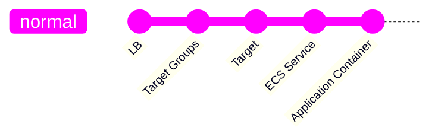
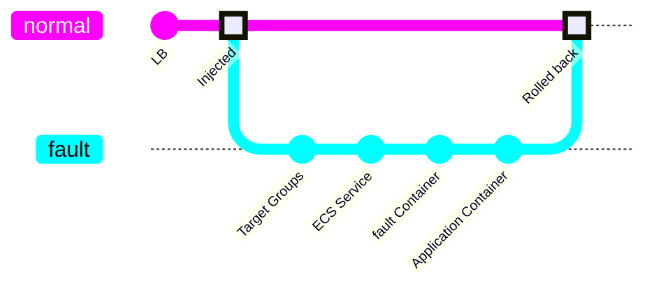

# Fault Injection Into AWS

This guide will walk you through injecting network faults into AWS ECS platform.
Without changing any application code.

???+ abstract "Prerequisites"

    -   [X] Install <span class="f">fault</span>

        If you haven’t installed <span class="f">fault</span> yet, follow the
        [installation instructions](../install.md).


???- question "How about other AWS services?"

    <span class="f">fault</span> supports ECS natively as well as EKS through
    the `fault inject kubernetes` command. What about EC2 or Lambda?

    Both may be featured in the future indeed if they are asked for by the 
    community.


## Inject Latency Into a ECS Service

ECS is the AWS platform to run workload using containers. The approach taken
by <span class="f">fault</span> is to add a sidecar container to an existing
ECS task definition. This container then becomes the entrypoint of network
traffic, meaning we switch the the Load Balancer target group to point to the
new container's port. <span class="f">fault</span> is configured to then route
all traffic from that port to the application's port transparently. When done,
we rollback to the previous task definition and load balancer configuration.

**raffic Before fault Is Injected**


**Traffic After fault Is Injected**



-   [X] Create a basic ECS service

    You may want to follow the official [AWS documentation](https://docs.aws.amazon.com/AmazonECS/latest/developerguide/create-service-console-v2.html) to create a service.

    Make sure to associate the service to a target group attached to a load
    balancer.

-   [X] Inject <span class="f">fault</span> into the ECS service

    The following injects a `800ms` into the service response time.

    ```bash
    fault inject aws \
        --region <region>  \  # (1)!
        --cluster <cluster-name> \  # (2)!
        --service <service-name> \  # (3)!
        --duration 30s \  # (4)!
        --with-latency --latency-mean 800
    ```

    1. The AWS region where your ECS service is running
    2. The AWS ECS cluster name
    3. The AWS ECS service name
    4. Optional [duration](https://docs.rs/parse_duration/latest/parse_duration/#syntax) after which the injection rollbacks. If unset, the user input is expected

    When you do not explicitly set the service, <span class="f">fault</span>
    lets you pick up one from the CLI:

    ```bash
    fault inject aws \
        --region <region>  \
        --cluster <cluster-name> \
        --with-latency --latency-mean 800
    ? Service:  
    > hello
    [↑↓ to move, enter to select, type to filter]
    ```

    Once started, a new revision of the service will be deployed with the
    <span class="f">fault</span> process running as a sidecar container
    of the service's main container. It will expose a port to receive traffic
    and route it to the application.
