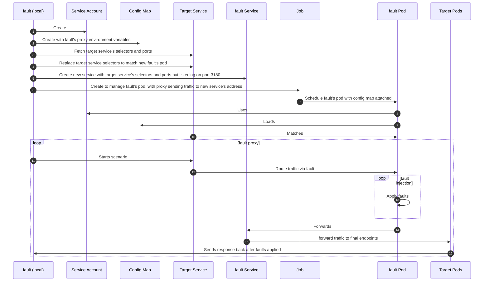

# Injecting <span class="f">fault</span> Into Your Platform

This page references the information about how <span class="f">fault</span> injects its resources
into the platform it supports.

## Kubernetes

<span class="f">fault</span> may run on Kubernetes by creating the following resources:

* a job (CronJob are not supported yet)
* a service
* a dedicated service account
* a config map that holds the environment variables used to configure the proxy



!!! note

    Once a scenario completes, <span class="f">fault</span> rollbacks the resources to their
    original state.

<span class="f">fault</span> uses the default Kubernetes authentication mechanism to connect
to the cluster: `~/.kube/config`, `KUBECONFIG`...

The authorizations for that user needs at least the following roles:

```yaml
apiVersion: rbac.authorization.k8s.io/v1
kind: Role
metadata:
  name: fault
rules:
  # ServiceAccounts (create/delete)
  - apiGroups: [""]
    resources:
      - serviceaccounts
    verbs:
      - create
      - delete
      - get

  # ConfigMaps (create/delete/get)
  - apiGroups: [""]
    resources:
      - configmaps
    verbs:
      - create
      - delete
      - get

  # Services (get/patch/delete)
  - apiGroups: [""]
    resources:
      - services
    verbs:
      - get
      - patch
      - delete

  # Jobs (create/delete/get/list)
  - apiGroups:
      - batch
    resources:
      - jobs
    verbs:
      - create
      - delete
      - get
      - list

  # Pods (list/get)
  - apiGroups: [""]
    resources:
      - pods
    verbs:
      - get
      - list
      - watch
```
