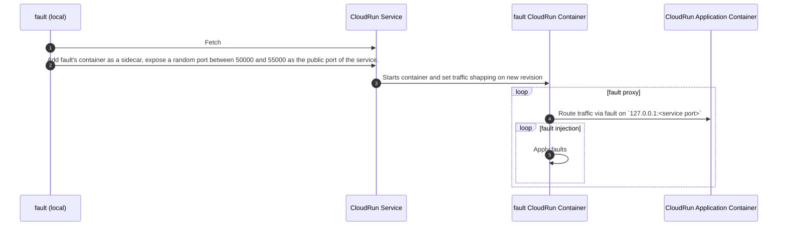

# Injecting <span class="f">fault</span> Into Your Platform

This page references the information about how <span class="f">fault</span> injects its resources
into the platform it supports.

## Google Cloud Platform

<span class="f">fault</span> may run on Google Cloud Platform by 
hooking into a Cloud Run service.

When initializing, <span class="f">fault</span> creates a new revision of the
service and injects a sidecar container into it. The container runs the
`fault` cli.

The new sidecar container also exposes a port between `50000` and `55000`.
This means that traffic will now be sent to the <span class="f">fault</span>
container which will reroute to `127.0.0.1:<service port>` where the
`<service port>` is the original port exposed by the Cloud Run service.

On rollback, a new revision is created with the previous specification of the
service.



<span class="f">fault</span> uses the default GCPO authentication mechanism to
connect to the project.

The roles for that user needs at least the following permissions:

- run.services.get
- run.services.list
- run.services.update

You should be fine with using the [roles/run.developer](https://cloud.google.com/run/docs/reference/iam/roles#run.developer) role.

## Kubernetes

<span class="f">fault</span> may run on Kubernetes by creating the following resources:

* a job (CronJob are not supported yet)
* a service
* a dedicated service account
* a config map that holds the environment variables used to configure the proxy


!!! note

    Once a scenario completes, <span class="f">fault</span> rollbacks the resources to their
    original state.

<span class="f">fault</span> uses the default Kubernetes authentication mechanism to connect
to the cluster: `~/.kube/config`, `KUBECONFIG`...

The authorizations for that user needs at least the following roles:

```yaml
apiVersion: rbac.authorization.k8s.io/v1
kind: Role
metadata:
  name: fault
rules:
  # ServiceAccounts (create/delete)
  - apiGroups: [""]
    resources:
      - serviceaccounts
    verbs:
      - create
      - delete
      - get

  # ConfigMaps (create/delete/get)
  - apiGroups: [""]
    resources:
      - configmaps
    verbs:
      - create
      - delete
      - get

  # Services (get/patch/delete)
  - apiGroups: [""]
    resources:
      - services
    verbs:
      - get
      - patch
      - delete

  # Jobs (create/delete/get/list)
  - apiGroups:
      - batch
    resources:
      - jobs
    verbs:
      - create
      - delete
      - get
      - list

  # Pods (list/get)
  - apiGroups: [""]
    resources:
      - pods
    verbs:
      - get
      - list
      - watch
```
